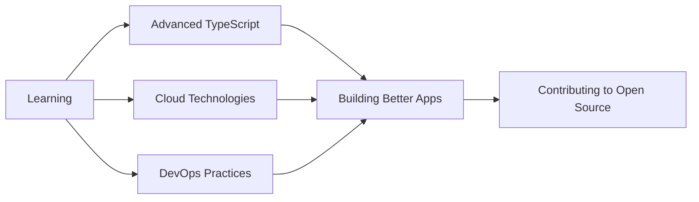

<div align="center">

# 👋 Hi there, I'm Biplob!

### 🚀 Full-Stack Developer | Problem Solver | Tech Enthusiast


[](https://github.com/biplobsec21)
[](https://github.com/biplobsec21?tab=followers)
[](https://github.com/biplobsec21)

</div>

---

## 💫 About Me

```javascript
const biplob = {
    location: "Mymensingh, Bangladesh",
    code: ["JavaScript", "TypeScript", "PHP", "HTML", "CSS"],
    technologies: {
        frontEnd: {
            js: ["React", "Next.js", "React Native"],
            css: ["Tailwind CSS", "Bootstrap"]
        },
        backEnd: {
            php: ["Laravel", "Blade"]
        },
        mobile: ["React Native"],
        databases: ["MySQL", "PostgreSQL"],
        tools: ["Git", "Chrome Extensions API", "REST APIs"]
    },
    currentFocus: "Building scalable web and mobile applications",
    funFact: "I debug code in my dreams! 🐛💤"
};
```


- 🔭 Currently working on **innovative full-stack projects**
- 🌱 Learning **Advanced TypeScript & Cloud Technologies**
- 💡 Interested in **Healthcare Tech, FinTech & Social Media Tools**
- 👨‍💻 All of my projects are available at [GitHub](https://github.com/biplobsec21)
- 💬 Ask me about **React, Laravel, Mobile Development**
- 📫 Reach me at **your.email@example.com**
- ⚡ Fun fact: **Code is poetry in logic!**

---

## 🛠️ Tech Stack & Tools

<div align="center">

### Frontend Development


### Backend Development


### Database


### Tools & Others


</div>

---

## 📊 GitHub Statistics

<div align="center">
  


</div>

---

## 🏆 GitHub Trophies

<div align="center">

[](https://github.com/ryo-ma/github-profile-trophy)

</div>

---

## 🌟 Featured Projects

<div align="center">

<a href="https://github.com/biplobsec21/financial-dashboard">
  
</a>
<a href="https://github.com/biplobsec21/accesscare">
  
</a>
<a href="https://github.com/biplobsec21/VidTok">
  
</a>
<a href="https://github.com/biplobsec21/video-downloader">
  
</a>

</div>

### 💼 Project Highlights

| Project | Description | Tech Stack | Stars |
|---------|-------------|------------|-------|
| 🏥 [AccessCare](https://github.com/biplobsec21/accesscare) | Healthcare platform for compassionate drug access | Laravel, Blade, PHP | ⭐ 2 |
| 💰 [Financial Dashboard](https://github.com/biplobsec21/financial-dashboard) | Full-featured financial management system | TypeScript, Next.js, React | ⭐ 2 |
| 📱 [VidTok](https://github.com/biplobsec21/VidTok) | Multi-platform video downloader mobile app | React Native, JavaScript | ⭐ - |
| 🔌 [Video Downloader](https://github.com/biplobsec21/video-downloader) | Chrome extension for Facebook Reels | JavaScript, Chrome API | ⭐ 1 |
| 🧾 [POS Recipe](https://github.com/biplobsec21/POS_recipe) | Point of Sale recipe management system | JavaScript | ⭐ 1 |
| 📊 [Attendance](https://github.com/biplobsec21/attendance) | Employee/Student attendance tracking | Laravel, Blade, PHP | ⭐ - |

---

## 📈 Contribution Graph

<div align="center">

[](https://github.com/ashutosh00710/github-readme-activity-graph)

</div>

---

## 💻 Most Used Languages

<div align="center">


</div>

---

## 🎯 Current Focus



---

## 💡 Areas of Expertise

<div align="center">

| 🌐 Web Development | 📱 Mobile Development | 🔧 Backend Systems |
|:------------------:|:---------------------:|:------------------:|
| React & Next.js | React Native | Laravel & PHP |
| TypeScript | Cross-platform Apps | RESTful APIs |
| Responsive Design | Native Features | Database Design |

| 🏥 Healthcare Tech | 💰 FinTech Solutions | 🎨 UI/UX Design |
|:------------------:|:--------------------:|:----------------:|
| Patient Management | Payment Systems | Modern Interfaces |
| Medical Records | Financial Dashboards | User Experience |
| Compliance Systems | Security & Auth | Accessibility |

</div>

---

## 🐍 Contribution Snake

<div align="center">


</div>

---

## 📫 Connect With Me

<div align="center">

[](https://github.com/biplobsec21)
[](https://linkedin.com/in/yourprofile)
[](https://twitter.com/yourhandle)
[](mailto:your.email@example.com)
[](https://yourportfolio.com)
[](https://dev.to/yourusername)

</div>

---

## 📝 Latest Blog Posts

<!-- BLOG-POST-LIST:START -->
- 🚀 Building Scalable Web Applications with Next.js
- 📱 React Native Best Practices for 2025
- 💡 10 Laravel Tips Every Developer Should Know
- 🎨 Modern UI/UX Trends in Web Development
<!-- BLOG-POST-LIST:END -->

➡️ [More blog posts...](https://yourblog.com)

---

## 🎓 Certifications & Achievements

<div align="center">

🏆 **Multiple GitHub Stars** | 💻 **Full-Stack Portfolio** | 🌍 **Open Source Contributor**

🎯 **Problem Solver** | 📚 **Continuous Learner** | 🤝 **Team Collaborator**

</div>

---

## 💼 Work Experience

```yaml
current:
  - title: "Full-Stack Developer"
    focus: "Web & Mobile Application Development"
    stack: ["React", "Next.js", "Laravel", "React Native"]
    
skills:
  frontend: ["React", "Next.js", "TypeScript", "Tailwind CSS"]
  backend: ["Laravel", "PHP", "REST APIs"]
  mobile: ["React Native", "Cross-platform Development"]
  other: ["Git", "Chrome Extensions", "Database Design"]
```

---

## 🎲 Fun Section

<div align="center">

### 😂 Random Dev Meme


### 🎯 Dev Quote


</div>

---

<div align="center">

### 💭 "First, solve the problem. Then, write the code." - John Johnson

### ⚡ "Code is like humor. When you have to explain it, it's bad." - Cory House

---

### 🚀 Open for Freelance Projects | Collaboration Opportunities | Full-Time Roles

**Let's build something amazing together!**


</div>
